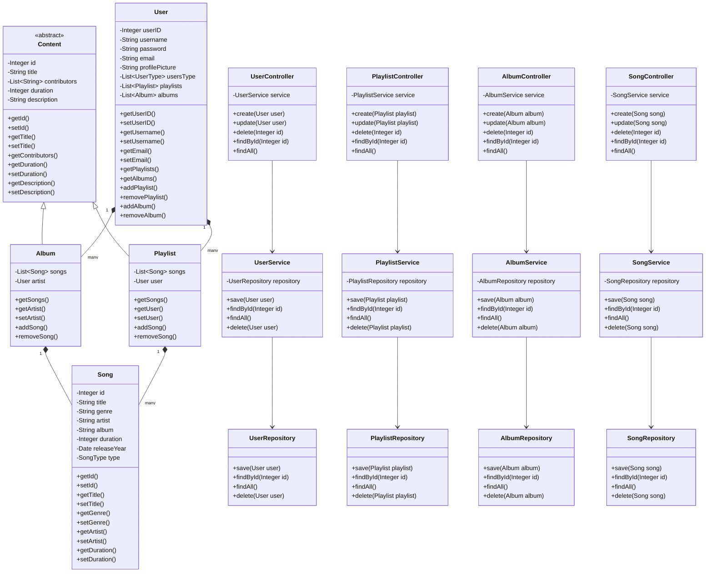
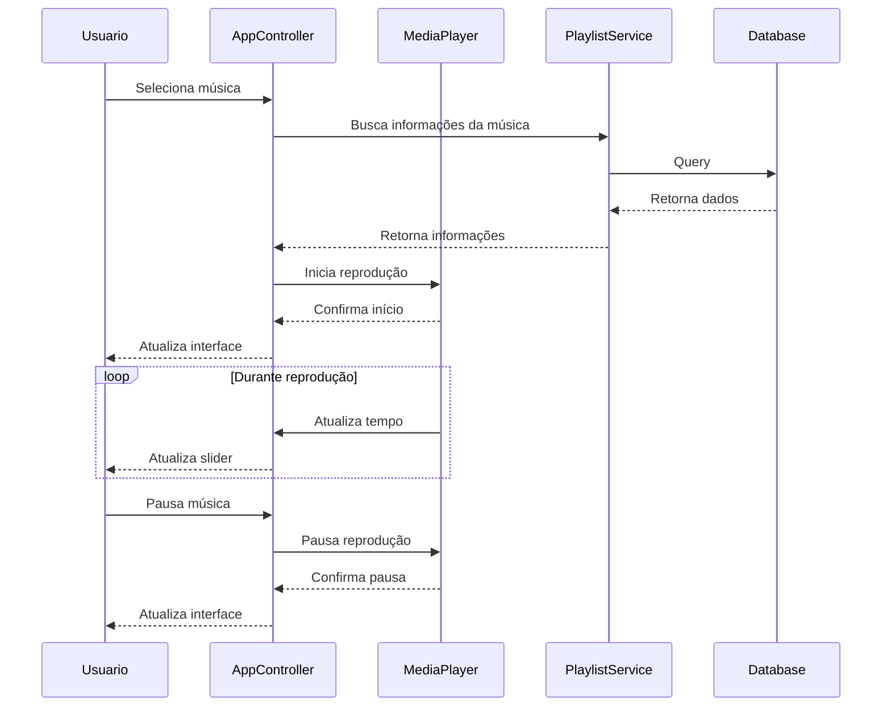

# Spotify Like App

```bash
SpotifyLikeApp/
├── src/
│   ├── main/
│   │   ├── java/
│   │   │   ├── controller/            # Controladores da interface JavaFX
│   │   │   ├── model/                 # Classes modelo para usuários, músicas, playlists
│   │   │   ├── utils/                 # Classes auxiliares 
│   │   │   ├── media/                 # Arquivos de música ou mídia
│   │   │   ├── servicies/             # Serivces
│   │   │   ├── repositories/          # repositories
│   │   │   └── MainApp.java           # Classe principal
│   │   └── resources/
│   │       ├── com.example.demo/      # Arquivos FXML para layouts JavaFX
│   │       └── hibernate.cfg.xml      # Configuração do Hibernate para conexão com o banco
│   └── test/                          # Testes do projeto
│       └── repositories/              # Testes dos repositórios
│           └── integration/           # Testes de integração
└── README.md                          # Documentação do projeto
```

### Diagrama UML



### Casos de uso:




### Projetos

O projeto foi desenvolvido em Java com a utilização do JavaFX para a interface gráfica. Implementado no padrão de projeto
MVC (Model-View-Controller) para separação de responsabilidades. Utilizamos testes de software no repository, pois onde continha a maior parte da lógica
da nossa aplicação.

No projeto foram usados os seguintes assuntos de Programção Orientada a Objetos: Herança, Polimorfismo, Encapsulamento, Abstração, Interfaces, Classes Abstratas.

### Repositories

Usamos o padrão de projeto Repository para abstrair a camada de persistência de dados. 
Com o hibernate, conseguimos mapear as entidades do banco de dados e realizar operações de CRUD.
E utilizamos o banco de dados H2 para armazenar os dados em memória por fins de praticidade.


### Services
No services, temos a camada de negócio da aplicação. Aqui é onde implementamos a lógica de negócio da aplicação.
Também por fins didáticos fizemos um service de maneira simples.

### Controller
Os controllers da nossa aplicação fazem a interação com o usuário, recebendo os dados e enviando pelo javaFX.

### Como rodar o projeto pelo terminal:

```bash
$ mvn compile
$ mvn javafx:run
```

UML do projeto:

### Funções Principais

#### Funções de Reprodução de Mídia

1. `initialize()`
  - Inicializa a aplicação
  - Configura a exibição da playlist
  - Configura o controle deslizante de tempo e os listeners do media player
  - Gerencia a inicialização dos componentes da interface

2. `playSong()`
  - Gerencia a reprodução da música atual
  - Cria uma nova instância do MediaPlayer
  - Atualiza elementos da interface (controle deslizante, rótulos)
  - Gerencia eventos de conclusão da música

3. `handleTogglePlayPause(ActionEvent event)`
  - Controla a funcionalidade de reproduzir/pausar
  - Alterna entre estados de reprodução e pausa
  - Inicializa a reprodução se nenhuma música estiver tocando

4. `handleNextSong()` / `handlePreviousSong()`
  - Navega para próximas/anteriores músicas na playlist
  - Gerencia navegação circular pela playlist
  - Atualiza o índice da música atual

#### Gerenciamento de Playlist

1. `handleCreatePlaylist(ActionEvent event)`
  - Cria uma nova playlist
  - Exibe diálogo para detalhes da playlist
  - Permite seleção de músicas
  - Salva playlist no banco de dados

2. `loadPlaylists()`
  - Carrega arquivos de música do diretório padrão
  - Valida arquivos de mídia reproduzíveis
  - Inicializa coleção de playlist

3. `updatePlaylistDisplay()`
  - Atualiza a ListView de playlist
  - Mostra títulos e contagem de músicas
  - Gerencia verificações de nulo e estados de erro

#### Gerenciamento de Músicas

1. `handleAddSongButtonClick()`
  - Abre seletor de arquivo para escolha de música
  - Valida formatos de arquivo de música
  - Adiciona músicas à playlist
  - Atualiza interface correspondentemente

2. `handleDeleteSongButtonClick()`
  - Remove música selecionada da playlist
  - Mostra diálogo de confirmação
  - Atualiza playlist e interface

3. `handleSongSelection()`
  - Gerencia seleção de música da lista
  - Atualiza índice da música atual
  - Inicia reprodução

#### Funções de Navegação e Interface

1. `handleLibraryButton(ActionEvent event)`
  - Abre visualização da biblioteca
  - Exibe playlists e seus conteúdos
  - Mostra descrições da playlist
  - Gerencia listagem de músicas

2. `handleLeaveButton(ActionEvent event)`
  - Salva estado atual de reprodução
  - Para o media player
  - Retorna à tela de login
  - Preserva dados da sessão

3. `handleProfileButton(ActionEvent event)`
  - Navega para tela de perfil do usuário
  - Gerencia transição de visualização do perfil
  - Gerencia atualizações da interface

### Funções Utilitárias

1. `isValidMusicFile(File file)`
  - Valida extensões de arquivo de música
  - Suporta formatos MP3, WAV e FLAC

2. `showAlert(String title, String content)`
  - Exibe diálogos de alerta
  - Mostra mensagens de informação e erro

3. `saveMusicState(int songIndex, double position)`
  - Salva posição atual de reprodução
  - Preserva índice da música
  - Utiliza API de Preferências para persistência

### Rastreamento de Atividade Recente

1. `updateRecentSongs(String songName)`
  - Mantém lista de músicas reproduzidas recentemente
  - Limita lista a 3 entradas
  - Atualiza interface com músicas recentes

### Detalhes Técnicos

- Utiliza JavaFX para componentes de interface
- Implementa reprodução de mídia usando JavaFX MediaPlayer
- Integra com Hibernate para persistência de dados
- Utiliza SLF4J para logging
- Implementa operações de sistema de arquivos para gerenciamento de música

### Tratamento de Erros

A aplicação implementa tratamento de erros abrangente:
- Valida arquivos de mídia antes da reprodução
- Verifica referências nulas em componentes da interface
- Fornece feedback ao usuário através de alertas
- Registra erros usando logger SLF4J


### Divisão de Tarefas no Projeto

O desenvolvimento do SpotifyLikeApp foi realizado de forma colaborativa, com uma clara divisão de responsabilidades entre Ramon e Paz, garantindo uma integração fluida entre o front-end e o back-end:

- Ramon (Back-end):
  - Responsável por toda a lógica e estrutura do lado servidor. Isso incluiu:
  - Desenvolvimento da camada de persistência utilizando Hibernate e o banco de dados H2.
  -  Implementação das funcionalidades de CRUD para gerenciamento de músicas, usuários e playlists.
  -   Criação das camadas de serviço (services) para lidar com a lógica de negócio.

- Paz (Front-end):
  - Focou no desenvolvimento da interface gráfica utilizando JavaFX. Suas contribuições incluíram:
  -  Criação dos layouts com arquivos FXML para oferecer uma experiência de usuário intuitiva e atraente.
  - Implementação dos controllers para capturar interações do usuário, como carregar músicas e gerenciar playlists.
  - Estilização e ajustes visuais para garantir uma apresentação consistente e agradável.


### Ambiente computacional
- Computador: Genérico
- Processador: AMD Ryzen 5 7600X 6-Core Processor
- RAM: 16GB
- Editor de Texto: Visual Studio Code
- IDE: nenhuma
- Sistema Operacional: Windows 11 Pro versão 24H2

Portanto, para a melhor execuçaõ, execute no sistema operacional Windows.

### Link para o video
https://drive.google.com/file/d/1bEUa0tTiksLQlKgpglvqzFSlq8R8rzhG/view


